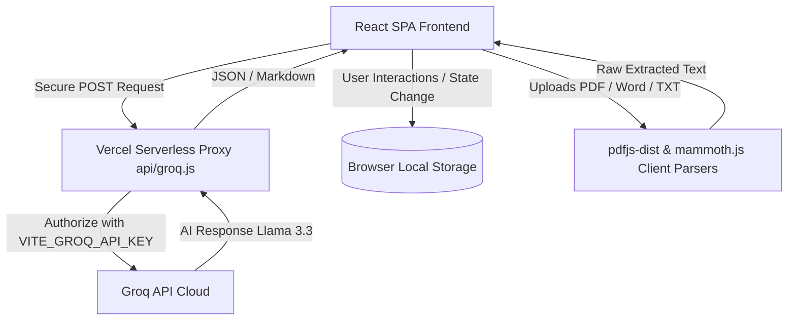

# TalentAI Tech Stack & Architecture Reference Guide

This document provides a comprehensive technical reference of all technologies, frameworks, libraries, and architectural patterns implemented in the TalentAI project. It is structured to serve as an onboarding guide and development blueprint.

---

## Architecture Overview

TalentAI is a modern AI-powered recruitment platform built as a Single Page Application (SPA) with a lightweight, secure backend proxy.



---

## 1. Frontend Core Frameworks & UI Layer

### React (v18.2.0)
*   **What it is:** A declarative, component-based JavaScript library for building interactive user interfaces.
*   **Where it is used:** Applied globally. All view files under [`src/pages/`](file:///e:/TalentAi/TalentAI/src/pages/) and reusable UI pieces under [`src/components/`](file:///e:/TalentAi/TalentAI/src/components/) are built as React functional components.
*   **What it powers:** Renders the layout, page navigation tabs, forms for uploading files, interactive sliders, chat input feeds, and results screens. It drives state hooks (`useState`, `useEffect`, `useRef`) for local UI states, API integration cycles, and side effects.
*   **Why it was chosen:** React provides a highly responsive component lifecycle suitable for dynamic single-page applications. It makes it easy to maintain UI components like loading bars, dialog overlays, and results lists, and integrates well with tools like Zustand and Framer Motion.

---

### Vite (v5.0.0)
*   **What it is:** A frontend build tool and development server designed for speed, utilizing native ES modules.
*   **Where it is used:** Configuration located at [`vite.config.js`](file:///e:/TalentAi/TalentAI/vite.config.js) and build script dependencies in [`package.json`](file:///e:/TalentAi/TalentAI/package.json).
*   **What it powers:** Performs hot module replacement (HMR) during local development, bundles application resources for production deployment, and manages environmental configurations. It compiles PDF.js worker files asynchronously using Vite-friendly URL imports (`pdfjs-dist/build/pdf.worker.mjs?url`).
*   **Why it was chosen:** Replaces legacy, slower bundlers (like Webpack or Create React App) to offer faster server startup and near-instant rebuilds. Its asset pipeline simplifies the loading of external modules, styles, and worker scripts in a Single Page Application.

---

### Zustand (v4.4.4)
*   **What it is:** A lightweight, hook-based state management library for React.
*   **Where it is used:** Located in the state store at [`src/store/useCandidateStore.js`](file:///e:/TalentAi/TalentAI/src/store/useCandidateStore.js).
*   **What it powers:** Serves as the central data store for all candidate profiles generated during resume scans. It provides the following actions:
    *   `candidates`: Global array of candidate details, scores, gaps, strengths, and raw resume texts.
    *   `theme`: Current UI skin selection (`dark` | `light` | `cyber`).
    *   `addCandidate()` / `deleteCandidate()`: Appends new screenings or removes individual records.
    *   `clearAll()`: Resets all candidate listings.
    *   `setTheme()`: Updates active visual preferences.
*   **Why it was chosen:** Avoids the boilerplate and complexity of Redux while providing performance benefits over React Context (which can cause unnecessary re-renders). Using Zustand's `persist` middleware, candidate data is saved directly to the browser's `localStorage` (named `talent-ai-storage`), keeping screenings available even after browser refreshes.

---

### Tailwind CSS (v3.3.5)
*   **What it is:** A utility-first CSS framework for building custom user interfaces directly within markup.
*   **Where it is used:** Styling configurations in [`tailwind.config.js`](file:///e:/TalentAi/TalentAI/tailwind.config.js), CSS directives in [`src/styles/globals.css`](file:///e:/TalentAi/TalentAI/src/styles/globals.css), and inline utility classes on almost all React nodes.
*   **What it powers:** Controls page layouts, custom sizing, glassmorphism card skins, responsive grid structures, flexbox spacing, and alignment utilities.
*   **Why it was chosen:** Speeds up UI styling by removing the need to write separate stylesheets. By utilizing CSS custom properties (variables) coupled with Tailwind classes, the app implements a system for switching between Dark, Light, and Cyber themes dynamically.

---

### Framer Motion (v10.16.4)
*   **What it is:** An animation library for React that simplifies creating transitions and complex gestures.
*   **Where it is used:** Integrated within pages like [`ResumeScreener.jsx`](file:///e:/TalentAi/TalentAI/src/pages/ResumeScreener.jsx), [`BiasDetector.jsx`](file:///e:/TalentAi/TalentAI/src/pages/BiasDetector.jsx), [`Candidates.jsx`](file:///e:/TalentAi/TalentAI/src/pages/Candidates.jsx), and structural wrappers like [`PageWrapper.jsx`](file:///e:/TalentAi/TalentAI/src/components/PageWrapper.jsx).
*   **What it powers:** Drives fluid transition effects:
    *   *Slide & Fade Transitions:* Smoothly wipes pages when switching sidebar tabs.
    *   *Modal Overlays:* Handles the presentation scale of the candidate details modal.
    *   *Hover & Click Micro-interactions:* Adds spring scale effects (`whileHover={{ y: -2 }}`) to candidate cards.
    *   *AnimatePresence:* Handles exit animations for elements leaving the React DOM tree.
*   **Why it was chosen:** Declarative styling allows animations to be bound directly to React states. It provides smooth, hardware-accelerated visual feedback that enhances user engagement.

---

## 2. Document Processing & Client-Side Extraction

### PDF.js (v5.5.207)
*   **What it is:** Mozilla's open-source HTML5-compliant library for parsing and rendering PDF files.
*   **Where it is used:** Imported and initialized in [`ResumeScreener.jsx`](file:///e:/TalentAi/TalentAI/src/pages/ResumeScreener.jsx).
*   **What it powers:** Parses raw binary array buffers from uploaded `.pdf` documents directly in the client's browser. It extracts text line-by-line across all document pages and compiles them into a unified string payload for the AI model to analyze.
*   **Why it was chosen:** Enables reading PDF documents on the client side without needing a backend document parsing server. To prevent freezing the browser UI during large document scans, it uses a dedicated background web worker via Vite integration:
    ```javascript
    import * as pdfjs from 'pdfjs-dist';
    import pdfWorker from 'pdfjs-dist/build/pdf.worker.mjs?url';
    pdfjs.GlobalWorkerOptions.workerSrc = pdfWorker;
    ```

---

### Mammoth.js (v1.11.0)
*   **What it is:** A fast Microsoft Word `.docx` parser designed to convert documents into plain text or HTML.
*   **Where it is used:** Imported and executed in [`ResumeScreener.jsx`](file:///e:/TalentAi/TalentAI/src/pages/ResumeScreener.jsx).
*   **What it powers:** Parses raw binary data from uploaded `.docx` resumes in the client's browser, extracting text fields:
    ```javascript
    const extractTextFromDocx = async (arrayBuffer) => {
        const result = await mammoth.extractRawText({ arrayBuffer });
        return result.value;
    };
    ```
*   **Why it was chosen:** Traditional Word parsers often require Node.js server runtimes. Mammoth.js runs in browser runtimes, allowing the application to process Word documents alongside PDF files with zero backend document processing dependencies.

---

## 3. Data Visualization & Text Formatting

### Recharts (v2.9.0)
*   **What it is:** A composable charting library built on React components and D3.
*   **Where it is used:** Implemented on the landing dashboard page [`Dashboard.jsx`](file:///e:/TalentAi/TalentAI/src/pages/Dashboard.jsx).
*   **What it powers:** Renders the "Recent Scores" bar chart showing candidate evaluations. It displays the last 10 screened profiles, dynamically color-coding each bar based on the candidate's score:
    *   *High Match (≥ 80):* Green bar (`#00FFB2`)
    *   *Moderate Match (60–79):* Yellow bar (`#FFD166`)
    *   *Low Match (< 60):* Red bar (`#FF6B6B`)
    Also renders custom tooltips showcasing candidate name and score details.
*   **Why it was chosen:** Built natively for React, which makes passing candidate state updates directly to chart attributes simple. SVG rendering ensures high-resolution charts that match the glassmorphic aesthetics of the dashboard.

---

### React Markdown (v10.1.0)
*   **What it is:** A React component that parses and renders Markdown text safely.
*   **Where it is used:** Embedded in the chat message interface inside [`HRCopilot.jsx`](file:///e:/TalentAi/TalentAI/src/pages/HRCopilot.jsx).
*   **What it powers:** Converts raw markdown responses (like headings, bulleted lists, bold text, numbered guides, and code blocks) from the AI copilot into structured React components.
*   **Why it was chosen:** Large language models often respond using markdown formatting. `ReactMarkdown` parses these responses safely on the client side, allowing the copilot to present organized interview questions, checklists, and formatted emails.

---

## 4. Icons & Styling Assets

### Lucide React (v0.292.0)
*   **What it is:** A React wrapper for the Lucide open-source SVG icon library.
*   **Where it is used:** Used across all pages and UI layout containers, including [`Sidebar.jsx`](file:///e:/TalentAi/TalentAI/src/components/Sidebar.jsx), [`Candidates.jsx`](file:///e:/TalentAi/TalentAI/src/pages/Candidates.jsx), and [`Settings.jsx`](file:///e:/TalentAi/TalentAI/src/pages/Settings.jsx).
*   **What it powers:** Provides crisp, vector-based interface iconography such as:
    *   `LayoutDashboard` (Overview)
    *   `FileSearch` (Screener)
    *   `Users` (Candidates)
    *   `MessageSquare` (Coach)
    *   `ShieldAlert` (Bias Detector)
    *   `Bot` (Copilot helper)
    *   `Settings` (Options)
    *   `Trash2`, `Calendar`, `ArrowRight` (Actions & Meta details)
*   **Why it was chosen:** SVGs scale without quality loss across high-DPI displays. Using Lucide's wrapper allows customization of size, stroke thickness, and color using Tailwind CSS, keeping icons aligned with the overall theme.

---

### Google Fonts (Syne & DM Sans)
*   **What it is:** Public web font service by Google.
*   **Where it is used:** Loaded via link tags in [`index.html`](file:///e:/TalentAi/TalentAI/index.html) and assigned as CSS variables in [`src/styles/globals.css`](file:///e:/TalentAi/TalentAI/src/styles/globals.css).
*   **What it powers:** Defines the visual hierarchy of typography throughout the application:
    *   *Syne:* A modern, high-character font used for primary page titles, card headers, and navigation tags.
    *   *DM Sans:* A clean, neutral sans-serif font designed for high readability in body copy, descriptions, form inputs, and extracted code windows.
*   **Why it was chosen:** Complements the glassmorphism UI layout, avoiding basic browser system fonts to give the interface a premium, polished look.

---

## 5. Secure AI Integration & Backend Services

### Groq Cloud API & Llama-3.3-70b-versatile
*   **What it is:** A high-speed inference engine running Meta's 70-billion parameter Llama 3.3 model.
*   **Where it is used:** AI client calls are routed through [`src/api/ai.js`](file:///e:/TalentAi/TalentAI/src/api/ai.js), which invokes the local server endpoint.
*   **What it powers:** Powers the core intelligence of the application:
    1.  *Resume Screener:* Analyzes raw extracted resume texts to output candidate names, scores, key strengths, potential gaps, fit summaries, and recommended hiring steps in JSON format.
    2.  *Bias Detector:* Evaluates job postings, flags exclusionary language (such as ageism or gendered terms), suggests changes, and drafts neutral alternatives.
    3.  *Interview Coach:* Generates personalized behavioral, technical, and cultural questions tailored to specific candidate profiles.
    4.  *HR Copilot:* A conversational assistant capable of answering questions about candidate metrics, drafting email templates, and formulating hiring templates.
*   **Why it was chosen:** Offers low latency for 70B-class models, enabling fast analysis. It supports JSON mode, allowing the app to request structured outputs with a low temperature (0.1) for consistent parsing.

---

### Vercel Serverless Function Proxy (`api/groq.js`)
*   **What it is:** A backend serverless endpoint that acts as a proxy for client requests.
*   **Where it is used:** Code located at [`api/groq.js`](file:///e:/TalentAi/TalentAI/api/groq.js). It handles POST calls to `/api/groq/chat/completions`.
*   **What it powers:** Secures authorization keys by preventing the client browser from communicating directly with Groq. Instead, client calls are routed through this serverless proxy, which attaches the hidden `VITE_GROQ_API_KEY` stored in Vercel's server environment.
*   **Why it was chosen:**
    *   *Security:* Storing API credentials directly on the client side exposes them to extraction via browser developer tools. Routing requests through a backend handler keeps keys secure.
    *   *CORS Prevention:* Avoids Cross-Origin Resource Sharing restrictions between the local frontend dev environment and Groq's APIs.
    *   *Serverless Architecture:* Requires zero server configuration or maintenance, scaling dynamically with traffic.

---

## Technical Summary Table

| Technology | Role | Key File Location(s) | Primary Purpose |
| :--- | :--- | :--- | :--- |
| **React 18** | UI Foundation | [`src/App.jsx`](file:///e:/TalentAi/TalentAI/src/App.jsx) | Renders views and handles component logic. |
| **Vite 5** | Development & Build | [`vite.config.js`](file:///e:/TalentAi/TalentAI/vite.config.js) | Serves as dev server, bundles assets, and handles modules. |
| **Zustand 4** | State Management | [`src/store/useCandidateStore.js`](file:///e:/TalentAi/TalentAI/src/store/useCandidateStore.js) | Persists candidate profiles and UI theme selections in localStorage. |
| **Tailwind CSS v3** | Styling Framework | [`tailwind.config.js`](file:///e:/TalentAi/TalentAI/tailwind.config.js) | Provides responsive, utility-based CSS and custom mode selectors. |
| **Framer Motion** | UI Animation | [`src/components/PageWrapper.jsx`](file:///e:/TalentAi/TalentAI/src/components/PageWrapper.jsx) | Animates page transitions, modals, and hover interactions. |
| **PDF.js** | Document Extraction | [`src/pages/ResumeScreener.jsx`](file:///e:/TalentAi/TalentAI/src/pages/ResumeScreener.jsx) | Extracts unicode text from PDF resumes on the client using a Web Worker. |
| **Mammoth.js** | Document Extraction | [`src/pages/ResumeScreener.jsx`](file:///e:/TalentAi/TalentAI/src/pages/ResumeScreener.jsx) | Extracts unicode text from DOCX resumes on the client. |
| **Recharts** | Data Visualization | [`src/pages/Dashboard.jsx`](file:///e:/TalentAi/TalentAI/src/pages/Dashboard.jsx) | Renders candidate evaluation scores in responsive bar charts. |
| **React Markdown** | Text Formatting | [`src/pages/HRCopilot.jsx`](file:///e:/TalentAi/TalentAI/src/pages/HRCopilot.jsx) | Renders AI copilot chat answers cleanly as HTML. |
| **Groq Cloud API** | AI Inference Engine | [`src/api/ai.js`](file:///e:/TalentAi/TalentAI/src/api/ai.js) | Processes text analysis requests using Llama 3.3. |
| **Vercel Serverless** | Secure API Proxy | [`api/groq.js`](file:///e:/TalentAi/TalentAI/api/groq.js) | Appends API keys securely in the server environment. |
